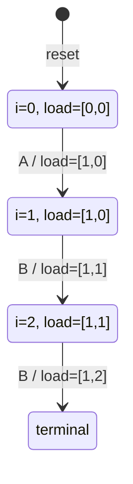
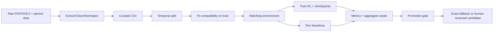

# Báo cáo thiết kế kỹ thuật: RL Student–Advisor Matching

> Tài liệu này mô tả phạm vi thuật toán, MDP tuần tự, thực nghiệm, workflow và hướng phát triển web. Nội dung phân biệt phần **đã có trong repo** với phần **đề xuất**.

## 1. Phạm vi và kết luận hiện tại

Hệ thống phân bổ một cohort sinh viên vào giảng viên hướng dẫn, tối ưu compatibility, workload và quota. Repo đã có curated data, TF-IDF/cosine compatibility, environment tuần tự, Maskable PPO, DQN/A2C/QRDQN, Random/Greedy/Exact/Gale–Shapley/SPA, temporal split, benchmark, checkpoint và promotion gate.

Không được kết luận PPO luôn tốt hơn: historical assignment không phải ground truth; preference/outcome/feedback chưa đủ tin cậy để đưa trực tiếp vào reward; dashboard vẫn là công cụ hỗ trợ quyết định.

## 2. Mô hình bài toán thành MDP tuần tự

Với `N` sinh viên, `M` giảng viên, `C[i,j]` là compatibility, `q[j]` là quota và `l[j]` là load:

```text
action a_i = j: gán sinh viên i cho giảng viên j
maximize Σ C[i,a_i] + fairness benefit
subject to l[j] <= q[j]
```

Mỗi episode là một cohort; mỗi timestep xử lý một sinh viên. Lựa chọn hiện tại làm thay đổi load, quota còn lại và action hợp lệ của các bước sau.

```mermaid
flowchart TD
    D[Curated thesis + advisor profiles] --> C[Compatibility matrix]
    C --> R[Reset: i=0, load=0]
    R --> S[State: C_i + remaining quota + current load]
    S --> M[Action mask: remove full advisors]
    M --> P[PPO / DQN / A2C / QRDQN]
    P --> A[Action: choose advisor j]
    A --> T[Transition: load[j]++, i++]
    T --> W[Reward: compatibility + fairness improvement]
    W --> Q{All students assigned?}
    Q -- No --> S
    Q -- Yes --> O[Assignment + metrics]
    O --> B[Benchmark baselines]
    B --> G[Promotion gate / human review]
```

## 3. State, action, transition, reward

### State

`src/environment/matching_core.py` tạo observation:

```text
[compatibility của student hiện tại,
 remaining_capacity / capacity,
 current_load / capacity]
```

Với `M` advisor, kích thước là `3M`. Compatibility mặc định dùng TF-IDF/cosine; sentence-transformer chỉ là backend opt-in và phải giữ cùng split/version khi benchmark.

### Action

Action là số nguyên `0..M-1`. PPO dùng `action_masks()` để loại advisor đầy quota. DQN không có mask chuẩn; environment ghi `invalid_proposals` và sửa action về ứng viên hợp lệ có compatibility cao nhất. Vì vậy DQN phải báo cáo metric invalid riêng.

### Transition

Với action hợp lệ `j`:

```text
load[j] <- load[j] + 1
student_index <- student_index + 1
```

Episode kết thúc khi xử lý hết cohort. Action không hợp lệ nhận penalty/kết thúc theo environment.

### Reward

Code hiện tại dùng:

```text
before = variance(load / capacity)
after  = variance(new_load / capacity)
reward = compatibility + 0.15 * (before - after)
```

Invalid action có penalty `-2.0`. Chưa đưa preference, satisfaction, grade hay outcome vào reward vì chưa có nhãn đáng tin cậy.

### Mô phỏng episode nhỏ

| Bước | Student | Compatibility `[A,B]` | Load trước | Action | Load sau |
|---:|---|---|---|---|---|
| 0 | S1 | `[0.90,0.40]` | `[0,0]` | A | `[1,0]` |
| 1 | S2 | `[0.80,0.70]` | `[1,0]` | B | `[1,1]` |
| 2 | S3 | `[0.30,0.85]` | `[1,1]` | B | `[1,2]` |

State bước 1:

```text
[0.80, 0.70, 0.50, 1.00, 0.50, 0.00]
```



Có thể mô phỏng trực quan bằng Mermaid, dashboard hiện có hoặc notebook/Streamlit nhận compatibility matrix và hiển thị observation, mask, action, reward sau từng bước. Hình thật đã có: [`figure5_rl_mdp_flow.png`](../outputs/figures/figure5_rl_mdp_flow.png), [`figure1_ppo_learning_curves.png`](../outputs/figures/figure1_ppo_learning_curves.png), [`figure2_constraint_violations.png`](../outputs/figures/figure2_constraint_violations.png), [`figure3_algorithm_comparison.png`](../outputs/figures/figure3_algorithm_comparison.png).

## 4. Thuật toán và baseline

| Phương pháp | Vai trò | Nhận xét |
|---|---|---|
| Maskable PPO | RL chính | Phù hợp policy gradient và action masking |
| DQN | RL đối chứng | Discrete action nhưng invalid proposal cao do không mask |
| A2C | RL bổ sung | Có trong training pipeline, cần benchmark công bằng |
| QRDQN | Value-based distributional | Có trong pipeline, cần đánh giá riêng |
| Random | Lower bound | Random trong candidate còn quota |
| Greedy Similarity | Baseline cục bộ | Chọn compatibility cao nhất tại mỗi bước |
| Exact/Hungarian | Upper bound/fallback | Tối ưu global theo matrix và capacity |
| Gale–Shapley/SPA | Matching truyền thống | Đánh giá stability và capacity |

Theo file `Baseline_Student_Advisor_Matching_PPO_DQN.docx`, mọi phương pháp phải dùng cùng input, compatibility pipeline, cohort, quota, preference proxy và evaluation protocol; phải lưu assignment, reward thành phần và metrics từng seed. Nếu chưa có preference thật, ranking từ similarity phải ghi là proxy.

### Có tiếp tục dùng PPO không?

Nên giữ PPO là **candidate nghiên cứu**, chưa mặc định production. PPO có lợi thế action masking và smoke run có invalid proposal bằng 0; nhưng exact có tối ưu global trên objective hiện tại, còn PPO chưa chứng minh vượt exact/Greedy ổn định. DQN không nên chọn chỉ vì reward cao nếu invalid proposal còn lớn.

Chỉ promote PPO khi: quota violations = 0; invalid proposals = 0; compatibility hold-out vượt exact theo margin; load variance chấp nhận; kết quả ổn định nhiều seed/cohort; có human review. Nếu không, exact là default/fallback.

## 5. Metrics đánh giá

| Metric | Cách đo | Tiêu chí |
|---|---|---|
| Mean compatibility | Trung bình `C[i,assignment[i]]` | Cao hơn, cùng matrix |
| Total reward | Tổng reward episode | Cao hơn, nhưng không dùng một mình |
| Load variance | Variance của load chuẩn hóa | Thấp hơn |
| Quota violations | Load vượt capacity | Bắt buộc bằng 0 |
| Invalid proposals | Action đề xuất không hợp lệ | Bằng 0 |
| Historical top-1 | Trùng assignment lịch sử | Chỉ tham khảo, không phải ground truth |
| Assigned | Số student được gán | Bằng cohort size |
| Mean/std qua seeds | Trung bình/độ lệch chuẩn | Cao và ổn định |
| Runtime | Thời gian inference | Đáp ứng SLA |
| Preference/outcome | Accept, đổi advisor, kết quả sau phân bổ | Hướng phát triển |

Không dùng một metric đơn lẻ. Model tốt phải có compatibility cao, constraint an toàn, fairness chấp nhận được, ổn định và không kém baseline có ý nghĩa.

## 6. Temporal split, benchmark, checkpoint

`src/data_pipeline/split_dataset.py` dùng toàn bộ dữ liệu trước 2025 và 75% nhóm sinh viên 2025 cho train; phần còn lại chia validation/test. Các record cùng student ở cùng split; TF-IDF chỉ fit train, hold-out chỉ transform. Nếu không tách theo năm, fallback deterministic 80/20 theo student.

`src/rl/benchmark.py` chạy mọi phương pháp trên cùng matrix, cohort và capacity. Smoke hiện có seed 42, train 156 rows, validation 20, test 22, 39 advisors, 512 timesteps. Kết quả smoke chỉ xác nhận pipeline; tài liệu RL ghi nhận Greedy `0.219228`, PPO ngắn `0.044382`, DQN `0.213330` nhưng DQN có 157 invalid proposals.

`src/rl/train.py` lưu cumulative checkpoints:

```text
outputs/models/{algorithm}_seed{seed}_steps{milestone}.zip
outputs/results/{algorithm}_seed{seed}_steps{milestone}.json
```

Các milestone hiện có gồm 500k, 1M, 2M cho nhiều thuật toán. Result ghi algorithm, timestep, seed, split metadata, train/validation và test ở milestone cuối. `model_registry.py` lưu checkpoint hash, dataset fingerprint, config, metrics, commit SHA; `promotion.py` aggregate nhiều run và loại model vi phạm hard constraint.

## 7. Workflow kỹ thuật



Feedback HCD cần bổ sung vào workflow: `proposal -> student/advisor/admin review -> accept/edit/reject + reason -> classify feedback -> update constraint/reward/data -> retrain/evaluate -> promotion`.

## 8. Hướng phát triển web

### Role sinh viên

Nhập skill/lĩnh vực/đề tài; tìm giảng viên phù hợp; xem đề tài trước đây giảng viên đã hướng dẫn; lưu preference; gửi nguyện vọng; accept/reject recommendation và ghi lý do.

### Role giảng viên

Cập nhật skill, quota, availability; xem sinh viên/đề tài phù hợp hoặc toàn bộ sinh viên theo quyền; lọc theo skill/compatibility; accept/decline; ghi lý do; xem workload và lịch sử hướng dẫn; đề xuất chỉnh sửa đề tài.

### Role admin/hội đồng

Chạy allocation; so sánh PPO/exact/Greedy/SPA; override có lý do; approve candidate model; xem audit/model version; rollback.

Feedback cần schema gồm actor, object, event, reason, `hcd_stage`, timestamp, model_version và dataset_version. Không đưa mọi feedback trực tiếp vào reward: feedback về quota sửa constraint, preference tạo label, outcome mới có thể làm reward dài hạn.

## 9. Dàn ý khóa luận

Xem [`dan_y_khoa_luan.md`](dan_y_khoa_luan.md). Dàn ý dựa trên `De_cuong_KLTN_PPO_DQN_Student_Advisor_Matching.docx` và được chú thích theo trạng thái code hiện tại: dữ liệu, NLP, environment, simulator, PPO/DQN, baseline, metrics, continuous learning, web, HCD và kế hoạch thí nghiệm.

## 10. Kết luận

Đóng góp kỹ thuật rõ nhất là MDP tuần tự quota-aware, benchmark công bằng giữa RL và baseline, temporal split chống leakage, checkpoint/provenance và safety gate. Bước tiếp theo không chỉ là tăng timestep: cần chạy nhiều seed/cohort, ablation và stress test; đồng thời thu preference, feedback, outcome và evidence workflow để reward/model phản ánh bài toán thực tế.
