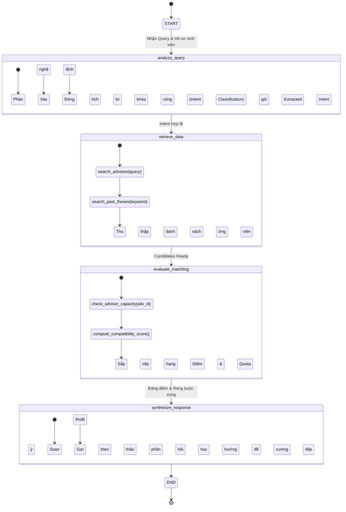
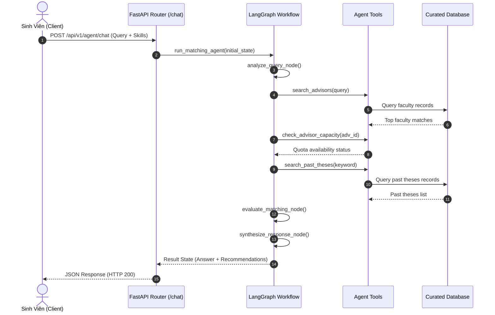

# Kiến Trúc Hệ Thống KLTN AI Matching Agent (Architecture Diagram)

Tài liệu mô tả chi tiết kiến trúc hệ sinh thái phân bổ đề tài và giảng viên hướng dẫn khóa luận tốt nghiệp (KLTN) bằng AI Agent và thuật toán tối ưu hóa đa mục tiêu.

---

## 1. Sơ Đồ Kiến Trúc 3 Tầng (3-Tier Architecture)

```mermaid
graph TD
    subgraph Client Layer [1. Lớp Trình Diễn - Presentation]
        FE[Next.js 14 Web Dashboard]
        ST[Streamlit Interactive Lab]
        API_DOCS[OpenAPI / Swagger UI]
    end

    subgraph Service Layer [2. Lớp Dịch Vụ & Xử Lý Nghiệp Vụ - Business Core]
        API[FastAPI Gateway / RESTful v1]
        
        subgraph Agent Engine [LangGraph StateGraph Workflow]
            N1[Node 1: Query Analyzer]
            N2[Node 2: Academic Retriever]
            N3[Node 3: Matcher & Constraint Evaluator]
            N4[Node 4: Explainable Synthesizer]
        end
        
        subgraph Optimization Engine [Phân Bổ Tối Ưu]
            HUNG[Hungarian Algorithm O_N3]
            RL[Maskable PPO Agent]
            GS[Gale-Shapley Stable Marriage]
        end
    end

    subgraph Data Layer [3. Lớp Dữ Liệu & Lưu Trữ - Persistence]
        MONGO[(MongoDB 7.0 / Motor Async)]
        SQLITE[(SQLite Curated Store)]
        AUDIT[(Audit JSONL Logs)]
    end

    FE -->|HTTP / SSE| API
    ST -->|HTTP| API
    API_DOCS -->|Docs Query| API

    API --> Agent Engine
    API --> Optimization Engine

    N1 --> N2
    N2 --> N3
    N3 --> N4

    N2 -->|Search Tools| MONGO
    N2 -->|Keyword Search| SQLITE
    N4 -->|Log Interaction| AUDIT
    Optimization Engine -->|Sync Matrix| MONGO
```

---

## 2. Luồng Trạng Thái LangGraph Agent (StateGraph Flow)



---

## 3. Sơ Đồ Trình Tự Cuộc Gọi API (Sequence Diagram)


