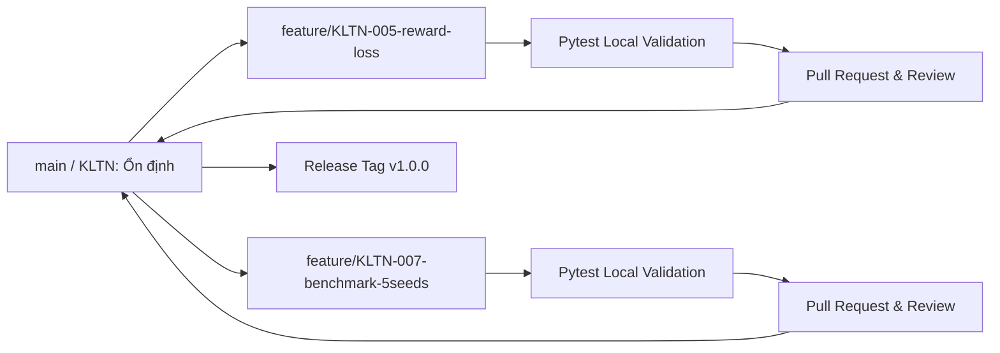

# GitFlow Guide — Product Repository

Tài liệu này áp dụng độc lập cho Git repository sản phẩm. Khi clone từ GitHub, thư mục hiện hành là Git root; planning/task orchestration bên ngoài không phải một phần của repository.

---

## 1. Mô Hình Phân Nhánh (Branching Model)



### 1.1. Nhánh Chính (`main` / `KLTN`)
- Là nguồn sự thật về mã nguồn có thể chạy được (deployable / runnable).
- Mọi commit tích hợp vào nhánh chính phải pass 100% unit tests và qua thẩm định.
- Không commit trực tiếp mã nguồn chưa qua kiểm thử lên nhánh chính.

### 1.2. Nhánh Tính Năng (`feature/<task-id>-short-name`)
- Mỗi nhánh tính năng ứng với **đúng một task ID** được cung cấp trong yêu cầu triển khai hoặc planning workspace local của người thực hiện.
- *Quy tắc đặt tên:*
  ```bash
  feature/KLTN-005-reward-loss
  feature/KLTN-007-benchmark-5seeds
  feature/KLTN-010-web-dashboard
  ```

### 1.3. Nhánh Sửa Nóng (`hotfix/<issue-name>`)
- Sử dụng khi phát hiện lỗi nghiêm trọng ảnh hưởng đến luồng chạy chính hoặc API bị crash.

### 1.4. Nhánh Phát Hành (`release/v<version>`)
- Dùng để đóng gói nghiệm thu trước các đợt nộp báo cáo (ví dụ: `release/v0.1.0`, `release/v1.0.0`).

---

## 2. Quy Chuẩn Commit Message

Mỗi commit phải ngắn gọn, tường minh và bắt buộc gắn với mã định danh Task:
```txt
<TASK-ID>: <mô tả thay đổi súc tích>
```

**Ví dụ chuẩn:**
- `KLTN-004: add action masking layer to GymMatchingEnv`
- `KLTN-005: implement load variance reduction bonus in reward function`
- `KLTN-007: add 5-seed benchmark evaluation runner script`

---

## 3. Quy Trình Làm Việc Hàng Ngày (Daily Workflow)

1. Đọc `agent.md`, yêu cầu triển khai và tài liệu kỹ thuật liên quan trong repo.
2. Cập nhật nhánh chính mới nhất:
   ```powershell
   git switch main
   git pull origin main
   ```
3. Tạo nhánh tính năng mới:
   ```powershell
   git switch -c feature/KLTN-XXX-name
   ```
4. Thực hiện code và viết unit/integration tests tương ứng.
5. Chạy validation phù hợp:
   ```powershell
   python -m pytest tests
   npm --prefix frontend run test:run
   npm --prefix frontend run build
   ```
6. Commit và đẩy nhánh lên remote:
   ```powershell
   git add .
   git commit -m "KLTN-XXX: detailed action description"
   git push -u origin feature/KLTN-XXX-name
   ```
7. Mở Pull Request, đính kèm evidence kiểm thử và chỉ merge khi đạt DoD.

Nếu người thực hiện sử dụng orchestration workspace local, task/sprint/checkpoint được cập nhật ở workspace đó sau khi product change đã được kiểm chứng; các file orchestration không cần tồn tại trong GitHub clone.
