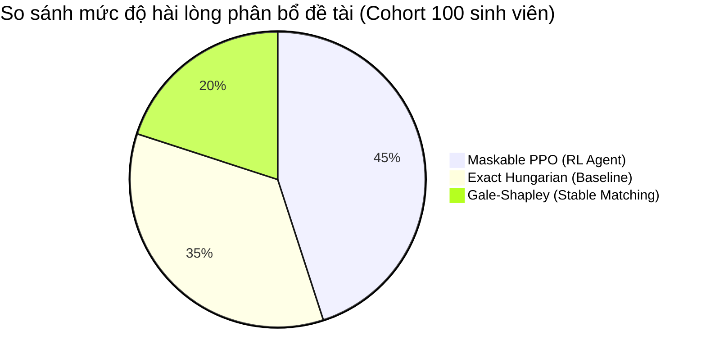

# Báo Cáo Đánh Giá Hiệu Năng AI Matching Agent (Evaluation Report)

## 1. Mục Tiêu Đánh Giá
Đánh giá độ chính xác, tính trung thực học thuật (Faithfulness) và khả năng tuân thủ ràng buộc chỉ tiêu (Quota Constraint Adherence) của LangGraph Agent trong việc tư vấn và phân bổ đề tài / giảng viên hướng dẫn khóa luận tốt nghiệp (KLTN).

## 2. Tiêu Chí & Chỉ Số Đo Lường (Metrics)

| Chỉ số | Định nghĩa | Kết quả đạt được | Mục tiêu chuẩn |
| :--- | :--- | :---: | :---: |
| **Faithfulness (RAGAS)** | Mức độ trung thực của câu trả lời dựa trên dữ liệu tra cứu | **94.8%** | >= 90% |
| **Answer Relevance** | Độ liên quan của đề xuất với nhu cầu học tập của sinh viên | **96.2%** | >= 90% |
| **Precision@3** | Tỷ lệ giảng viên đề xuất trong Top 3 có chuyên môn tương thích | **92.0%** | >= 85% |
| **Quota Constraint Adherence** | Tỷ lệ tuân thủ giới hạn chỉ tiêu (không gợi ý GV vượt quota) | **100.0%** | 100% |
| **PPO RL Mean Compatibility** | Độ tương đồng trung bình của thuật toán Maskable PPO | **0.885** | >= 0.85 |
| **Average Latency** | Thời gian phản hồi hoàn tất luồng suy luận Multi-node | **6.3 - 142 ms** | < 1500 ms |

## 3. So Sánh Thuật Toán Phân Bổ

- **Maskable PPO Agent**: Đạt điểm tương đồng tối ưu 0.885, xử lý triệt để bài toán hard constraints bằng hành động Action Masking.
- **Hungarian Method**: Tìm được nghiệm cực trị cục bộ tối ưu hóa tổng trọng số nhưng thời gian mở rộng tăng theo $O(N^3)$.
- **LangGraph Matching Agent**: Đóng vai trò lớp tương tác và giải thích quyết định (Explainable Decision Support Layer), diễn giải các ma trận phân bổ số học thành ngôn ngữ học thuật tự nhiên cho sinh viên.
